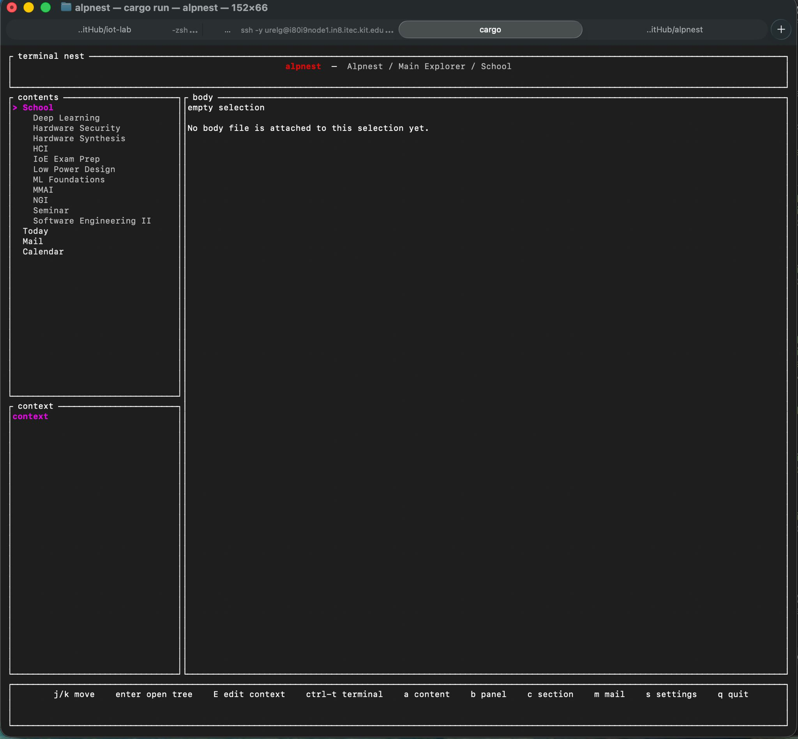
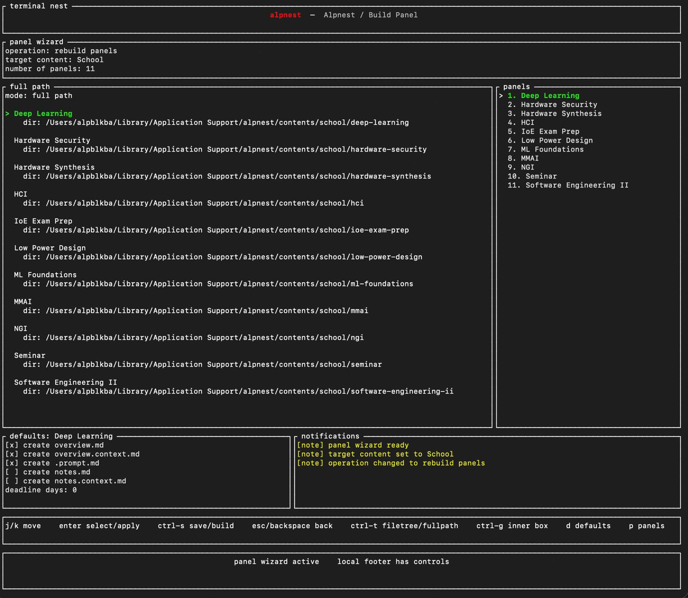

# alpnest

Alpnest is a local-first terminal cockpit for organizing working context across projects, courses, mail, calendar surfaces, notes, and shell workflows.

It is built around a filesystem-backed content model and a Ratatui interface. The goal is to keep the user's operational context close to the terminal: inspect the current work surface, navigate related panels and sections, open markdown context, run a shell in the right pane, and build new working structures without leaving the TUI.



## Table of contents

- [Overview](#overview)
- [Status](#status)
- [Core concepts](#core-concepts)
  - [Views](#views)
  - [Contents](#contents)
  - [Panels](#panels)
  - [Sections](#sections)
- [Application views](#application-views)
  - [Main explorer](#main-explorer)
  - [Content editor](#content-editor)
  - [Panel wizard](#panel-wizard)
  - [Settings](#settings)
  - [Reserved views](#reserved-views)
- [Filesystem model](#filesystem-model)
- [Runtime paths](#runtime-paths)
- [Configuration](#configuration)
- [Embedded terminal](#embedded-terminal)
- [Mail pipeline](#mail-pipeline)
- [Build and run](#build-and-run)
- [Development commands](#development-commands)
- [Registry debugging](#registry-debugging)
- [Implementation trace](#implementation-trace)
- [Roadmap](#roadmap)

## Overview

Alpnest is not a general-purpose IDE and it is not a replacement for a shell, editor, mail client, or calendar. It is a terminal-native context layer that sits above those tools.

The application is designed for workflows where the user repeatedly needs to answer:

- what work surface am I in?
- which projects, courses, or operational panels belong to it?
- where are the body and context files for the current selection?
- what should be opened in the right-pane terminal?
- which mail or calendar signals need attention?
- what structure should be created before work begins?

The main design principles are:

- local files before hidden application state
- readable markdown before opaque storage
- explicit context before automation
- terminal-native navigation before browser-heavy UI
- user runtime data outside the source tree
- deterministic scaffolding for contents, panels, and sections

## Status

Implemented:

- Ratatui main explorer
- dynamic content registry backed by the filesystem
- content/panel/section navigation
- content editor with add/edit/remove modes
- panel wizard for batch panel creation
- panel display titles loaded from `.panel.cfg`
- per-panel defaults for generated files
- embedded right-pane PTY terminal
- Vim/editor workflow inside the TUI
- right-pane shell toggle in main workflows
- settings file under the runtime configuration directory
- local-first mail pipeline modules and generated mail surfaces

Partially implemented or reserved:

- panel rebuild workflow
- panel rename/move workflow
- destroy confirmation polish
- section creation/cooking workflow
- calendar-specific rendering
- complete terminal-emulator behavior for the embedded terminal
- typed manifest parsing beyond the current minimal parser

## Core concepts

Alpnest separates UI state from content state.

```text
app view != content
```

An app view is an interaction surface: main explorer, content editor, panel wizard, settings, and future section/mail/calendar views.

A content is a filesystem-backed work surface: for example school, projects, mail, calendar, job, today, or any other configured top-level area.

The content tree has three layers:

```text
content
  panel
    section
```

### Views

Views are application modes. They define how input is handled and how the terminal is laid out.

Current views:

- main explorer
- content editor
- panel wizard
- settings

Reserved views:

- cook section
- configure mail
- calendar-specific surfaces
- future agentic development surfaces

### Contents

A content is a top-level work surface.

Examples:

- `Today`
- `School`
- `Projects`
- `Mail`
- `Calendar`
- `Job`

A content may be minimal, with only an overview/context pair, or it may contain many panels.

Content metadata may be described by a hidden manifest such as:

```text
.today.cfg
.mail.cfg
.calendar.cfg
.school.cfg
.projects.cfg
```

A content has:

- id
- display title
- content type
- root path
- optional body path
- optional context path
- panels
- order
- hidden flag

### Panels

A panel belongs to exactly one content. It represents a major unit of work inside that content.

Examples under a school content:

- Deep Learning
- Hardware Security
- Low Power Design
- Software Engineering II

Examples under a projects content:

- alpnest
- iot-lab
- rv32i-mla
- hardware-security

Panel display titles and filesystem slugs are intentionally separate.

```text
title: Software Engineering II
slug:  software-engineering-ii
path:  contents/school/software-engineering-ii/
```

A panel may contain:

```text
.panel.cfg
.prompt.md
overview.md
overview.context.md
notes.md
notes.context.md
additional section files
```

The `.panel.cfg` file stores panel metadata. The `.prompt.md` file is panel-local and should be interpreted as scoped context for that panel, not as global application behavior.

### Sections

A section belongs to a panel. It is usually represented by a markdown body file and an optional context file.

Typical section pairs:

```text
overview.md
overview.context.md

notes.md
notes.context.md
```

Dotfiles and config files are hidden from normal explorer navigation. User-facing section files remain visible.

## Application views

### Main explorer

The main explorer is the default view. It shows the content tree, current context, current body, and optionally the embedded terminal.

Layout:

```text
header
left top:     content / panel / section tree
left bottom:  context pane
right:        body pane or embedded terminal
footer:       controls
```

Typical controls:

```text
j/k            move
enter          open tree / descend
E              edit selected context markdown
Ctrl-T         toggle right-pane shell
a              content editor
b              panel wizard
c              cook section placeholder
m              mail configuration placeholder
s              settings
q              quit
```

When the embedded terminal is inactive, the right pane shows markdown content for the selected item. When the embedded terminal is active, the same pane becomes a live PTY-backed shell or editor surface.

### Content editor

The content editor manages top-level content surfaces.

Modes:

```text
add new content
edit existing content
remove existing content
```

Content creation is intentionally less complex than panel creation. A content is a broad category. Most repeated structure work is expected to happen through panels and sections.

### Panel wizard

The panel wizard is a dedicated view for creating and inspecting panels under a selected content.

Panel creation is common enough that it needs a structured workflow instead of ad-hoc shell commands or manual directory creation. The wizard supports batch creation, panel-local defaults, full-path previews, and filetree previews.



Panel wizard layout:

```text
header:        operation, target content, panel count
middle left:   full-path preview or filetree preview
middle right:  panel list
bottom left:   defaults for the selected panel
bottom right:  notifications
footer:        panel-wizard controls
```

Operations:

```text
build panels
rebuild panels
destroy panels
```

The build workflow supports:

- editing the number of panels explicitly
- editing panel titles with spaces
- slugifying panel paths
- preserving display titles in `.panel.cfg`
- per-panel file defaults
- full-path preview before writing
- filetree preview before writing
- explicit save/build through `Ctrl-S`

Panel wizard controls:

```text
j/k or arrows       move
enter               select/apply current field
Ctrl-S              save/build current operation
esc/backspace       local back or exit
Ctrl-T              toggle full-path/filetree preview
Ctrl-G              focus inner preview
p                   focus panel list
d                   focus defaults for selected panel
r                   rename/move placeholder
f                   focus top fields
```

Inside the panel wizard, `Ctrl-T` does not open the embedded shell. It toggles the inner preview mode. The shell toggle remains a main-explorer workflow.

Example panel manifest generated by the wizard:

```toml
schema_version = 1
id = "deep-learning"
title = "Deep Learning"
kind = "panel"
hidden = false
order = 0
prompting_enabled = true
deadline_enabled = false
deadline_days = 0
```

### Settings

The settings view edits runtime behavior.

Current settings include:

- text editor command
- terminal layout
- reload after external edit
- theme placeholder
- keymap placeholder
- agentic development placeholder

Example config:

```toml
text_editor = "vim"
terminal_layout = "built_in_right_pane"
reload_after_external_edit = true
theme = "default"
keymap = "default"
agentic_development = false
```

### Reserved views

Reserved views exist so the UI model can grow without treating every workflow as a content item.

Current reserved directions:

- section cooking and scaffolding
- mail account configuration
- calendar-specific rendering
- local agent handoff and workflow surfaces

## Filesystem model

The source repository may contain generic defaults, but user runtime data is resolved separately.

A typical runtime tree looks like:

```text
ALPNEST_HOME/
  config/
    alpnest.toml
  contents/
    school/
      deep-learning/
        .panel.cfg
        .prompt.md
        overview.md
        overview.context.md
      hardware-security/
        .panel.cfg
        overview.md
        overview.context.md
    projects/
      alpnest/
      iot-lab/
    mail/
    calendar/
  drafts/
  generated/
```

The registry loads visible content from the configured content root. Dotfiles and manifests are used for metadata but are not shown as normal sections.

Panel names are slugified for paths:

```text
Deep Learning           -> deep-learning
Software Engineering II -> software-engineering-ii
Low Power Design        -> low-power-design
```

The display title is preserved separately in the manifest.

## Runtime paths

Runtime path resolution is handled by `AlpnestPaths`.

Priority:

```text
ALPNEST_HOME
platform default
```

On macOS, the default runtime location is:

```text
~/Library/Application Support/alpnest
```

This allows development runs to use:

```sh
cargo run
```

without exporting `ALPNEST_HOME` every time.

## Configuration

Alpnest uses small manifest files for content and panel metadata.

Content manifests:

```text
.<content>.cfg
.today.cfg
.mail.cfg
.calendar.cfg
```

Panel manifests:

```text
.panel.cfg
```

These manifests are intended for stable configuration such as:

- schema version
- id
- title
- type/kind
- hidden flag
- order
- prompting settings
- deadline settings
- future watcher definitions

They should not store volatile runtime state such as:

- generated mail summaries
- latest git status
- probe results
- CI state
- temporary agent output
- secrets or tokens

Volatile state belongs under generated runtime directories.

## Embedded terminal

Alpnest includes a PTY-backed right-pane terminal.

Current stack:

```text
portable-pty  -> process and PTY
vt100         -> terminal screen parser
ansi-to-tui   -> ANSI text conversion
Ratatui       -> rendering
```

Implemented behavior:

- `Ctrl-T` opens/closes a right-pane shell from main workflows
- selected markdown context can be opened in the embedded editor
- Vim can run inside the right pane
- user Vim configuration can load
- shell commands can be run without leaving the TUI
- closing the embedded editor reloads the registry when configured

Known limitations:

- rendering is usable but not a complete terminal emulator
- mouse forwarding is not complete
- Vim split handling is functional but not as smooth as a native terminal
- a future renderer should move closer to cell-grid terminal rendering

## Mail pipeline

Alpnest has a local-first mail pipeline for multi-account mail ingestion, deterministic triage, Qwen-backed summarization, and generated TUI surfaces.

Mail is not modeled as a direct IMAP client inside the TUI. The current design separates the pipeline into small stages:

```text
Apple Mail / local mail source
  -> local sync/fetch script
  -> messages.json + eventstreams.json
  -> deterministic filters and fallback classification
  -> optional Qwen summarization through Ollama
  -> generated markdown mail views
  -> Alpnest content/view surfaces
```

The pipeline is intentionally staged. Fetching mail, storing raw/local state, grouping messages into event streams, filtering noise, summarizing with a model, and rendering markdown are separate operations. This keeps failures debuggable and allows each stage to be replaced independently.

### Mail storage model

The Python mail scripts use the local Alpnest data home:

```text
~/.local/share/alpnest/
  raw/mail/messages/          raw fetched message bodies
  store/messages.json         normalized message records
  store/eventstreams.json     sender/subject grouped mail streams
  store/mail_sync_state.json  sync metadata
  generated/mail.md           generated mail overview
  generated/mail_<account>.md generated account-specific views
  generated/mail_decomposition.md
```

The current sync path is Apple Mail oriented. `scripts/sync_mail_apple.py` syncs recent Apple Mail messages into the local store. The script models messages as normalized `Message` records and groups them into sender/subject event streams. Metadata-only sync is supported by default, while full body fetching is optional because Apple Mail body extraction through AppleScript can be slow on long or HTML-heavy mail.

The pipeline tracks multiple accounts. The renderer currently orders known account surfaces such as `kit`, `gmail`, `icloud`, and `unknown`, and writes one account-specific digest per account in addition to the main mail overview.

### Deterministic filtering

Before model summarization becomes useful, obvious noise needs to be filtered deterministically. Alpnest uses `scripts/mail_filters.cfg` for mute/filter rules. These rules affect generated Alpnest projections only; they do not delete real mail, raw body files, `messages.json`, or `eventstreams.json`.

The filter layer handles sender, subject, body, and summary patterns. It is used for low-value streams such as social notifications, newsletters, shopping/promotional mail, product marketing, webinar mail, and other account-only or hidden items.

The summarizer also has deterministic category and attention fallback logic for common patterns such as school, assignment, exam, lab, seminar, meeting, GitHub, security, event, application, newsletter, promotion, and unknown mail.

### Qwen summarization

The local summarization script is `scripts/summarize_mail_local.py`.

It uses a prompt pack under:

```text
prompts/qwen/mail_summarizer/
  system.md
  context.md
  task.md
  output_schema.md
  rubric.md
  examples.md
  failure_modes.md
```

The current default model is:

```text
qwen3:8b
```

The model is called through Ollama's local HTTP API:

```text
http://localhost:11434/api/generate
```

The request uses:

```text
model: qwen3:8b
stream: false
think: false
temperature: 0.1
format: JSON schema
```

The summarizer sends a compact prompt containing the prompt pack plus one mail payload. The payload includes account, sender, subject, received time, body status, and either the fetched body, snippet, or metadata-only fallback. Bodies are capped before prompting so that long or HTML-heavy messages do not dominate the prompt.

The Qwen role is deliberately narrow. It is not a planner, project manager, scheduler, or general assistant. Its job is to convert one email or event stream into a compact JSON digest while preserving visible facts.

The prompt contract requires the model to:

- clean sender and subject for display
- summarize in one or two short English sentences
- preserve explicit actions
- preserve explicit deadlines, dates, times, locations, course names, assignment names, exam names, lab names, and seminar names
- classify the mail into one allowed category
- choose an attention target: `overview`, `account_only`, or `hidden`
- choose importance: `high`, `medium`, or `low`
- provide retention hints such as `24h`, `3d`, `7d`, `until_deadline`, `keep`, or `hidden`
- mark `needs_human_review` when the message may matter but the payload is incomplete or ambiguous
- avoid guessing missing actions, deadlines, senders, courses, meetings, or importance
- output JSON only

### Summary schema

The summarizer writes normalized fields back into `eventstreams.json`.

Important fields include:

```text
display_sender
display_subject
summary_local
category_guess
attention / attention_guess
importance / importance_guess
action_required
action
deadline
date_or_time
retention_hint
source_language
summary_language
noise_guess
needs_human_review
summary_confidence
summary_source
summary_updated_at
```

The model-facing JSON schema includes:

```json
{
  "display_sender": "string",
  "display_subject": "string",
  "summary": "string",
  "category": "school|admin|assignment|exam|lab|seminar|research|project|work|career|application|meeting|event|calendar|security|finance|travel|github|tool|newsletter|promotion|shopping|social|noise|unknown",
  "attention": "overview|account_only|hidden",
  "importance": "high|medium|low",
  "action_required": false,
  "action": null,
  "deadline": null,
  "date_or_time": null,
  "retention_hint": "24h|3d|7d|until_deadline|keep|hidden",
  "source_language": "tr|en|de|mixed|unknown",
  "summary_language": "en",
  "noise": false,
  "needs_human_review": false,
  "confidence": 0.0
}
```

The schema is enforced in two places: the prompt pack specifies the expected output contract, and the Ollama request passes a JSON schema through the `format` field. The Python layer still validates and normalizes the model output because local models can produce invalid, incomplete, or overconfident responses.

### Fallback behavior

Qwen summarization is optional. The summarizer can run with deterministic fallback only:

```sh
python3 scripts/summarize_mail_local.py --no-ollama
```

Fallback mode is also used when:

- Ollama is unavailable
- the model times out
- the response is not valid JSON
- the message is obvious deterministic noise
- only metadata is available and the script can produce a safer limited digest

Fallback summaries use visible sender, subject, snippet, fetched body excerpts when available, deterministic category hints, attention inference, retention inference, and conservative confidence values.

### Rendering generated mail views

`/scripts/generate_mail_view.py` renders readable markdown from the local mail store.

It writes:

```text
generated/mail.md
```

and one account-specific view per account:

```text
generated/mail_kit.md
generated/mail_gmail.md
generated/mail_icloud.md
generated/mail_unknown.md
```

The renderer groups streams by account, computes account stats, hides likely noise from the main overview, and keeps account-specific digests available for browsing. Stream badges expose useful status such as category, summarized/body/metadata source, human-review marker, action marker, and deadline marker.

`/scripts/generate_mail_decomposition.py` writes a more detailed local snapshot to:

```text
generated/mail_decomposition.md
```

That file is not the LLM integration. It is a readable decomposition/debug artifact for inspecting messages, event stream metadata, body status, payload hashes, snippets, sync state, and placeholders for future task decomposition.

### Typical commands

Sync mail from Apple Mail:

```sh
python3 scripts/sync_mail_apple.py
```

Summarize recent streams with the default local Qwen model:

```sh
python3 scripts/summarize_mail_local.py
```

Summarize more streams:

```sh
python3 scripts/summarize_mail_local.py --limit 50
```

Force resummarization:

```sh
python3 scripts/summarize_mail_local.py --force
```

Use a different Ollama model:

```sh
python3 scripts/summarize_mail_local.py --model qwen3:14b
```

Run deterministic fallback only:

```sh
python3 scripts/summarize_mail_local.py --no-ollama
```

Render markdown mail views:

```sh
python3 scripts/generate_mail_view.py
```

Render the debug decomposition snapshot:

```sh
python3 scripts/generate_mail_decomposition.py
```

Run the wrapper:

```sh
scripts/alpnest-mail-sync.sh
```

### Design constraints

The mail pipeline should not store credentials or provider tokens in content manifests. Mail credentials belong in the user's mail client, keychain, environment, or another dedicated secret mechanism.

Generated summaries are runtime artifacts. They belong in local generated state, not in `.cfg` manifests.

The mail backend is separate from the generic content registry. The registry can show generated mail views, but syncing, filtering, summarization, and rendering remain independent pipeline stages.

## Build and run

Install from the repository:

```sh
cargo install --path . --force
```

Run during development:

```sh
cargo run
```

Run the installed binary:

```sh
alpnest
```

Run with an explicit runtime home:

```sh
ALPNEST_HOME="$HOME/Library/Application Support/alpnest" cargo run
```

## Development commands

Format and check:

```sh
cargo fmt --check
cargo check
cargo test
```

Run the TUI:

```sh
cargo run
```

Inspect the content registry:

```sh
cargo run --bin inspect_content_registry
```

Generate the mail feed:

```sh
cargo run --bin generate_mail_feed
```

Run the mail sync wrapper:

```sh
scripts/alpnest-mail-sync.sh
```

## Registry debugging

Inspect runtime content:

```sh
find "$HOME/Library/Application Support/alpnest/contents" -maxdepth 3 -print
```

Inspect panel manifests:

```sh
find "$HOME/Library/Application Support/alpnest/contents" -name ".panel.cfg" -print
```

Run the registry inspector:

```sh
cargo run --bin inspect_content_registry
```

The registry inspector is useful for validating:

- discovered contents
- panel ordering
- panel display titles
- synthetic panels
- section body/context pairing
- hidden manifest handling

## Implementation trace

This section records the current implementation direction and design decisions.

### Runtime data separation

The runtime content root was moved behind `AlpnestPaths`.

Important decisions:

- content loading uses a resolved runtime content directory
- config is stored under `ALPNEST_HOME/config/alpnest.toml`
- generated drafts and runtime files stay outside the source tree
- the app can run with `cargo run` using platform defaults

### Embedded terminal

The right pane can now host a live PTY-backed shell or editor.

Important decisions:

- use `portable-pty` for the process boundary
- parse terminal output through `vt100`
- render ANSI output into Ratatui
- support editor-first workflows without leaving the app
- keep `Ctrl-T` as a shell toggle outside the panel wizard

### Content editor

The content editor supports:

- add content
- edit existing content
- remove existing content

Content creation is intended to be less frequent than panel creation.

### Panel wizard

The panel wizard was added to make panel creation reliable and repeatable.

Important decisions:

- panels are batch-created under a selected content
- panel titles may contain spaces
- paths are slugified
- display titles are stored in `.panel.cfg`
- defaults are per-panel
- preview state does not write files
- `Ctrl-S` is the explicit save/build action
- filetree preview should eventually show all real files in the panel, including sections

## Roadmap

Near-term:

- finish rebuild mode in the panel wizard
- implement safe display-title rename
- design guarded path rename/move semantics
- improve destroy confirmation UX
- make filetree preview read the actual filesystem after creation
- add section creation and section cooking
- add body/context scrolling
- improve embedded terminal rendering
- strengthen typed manifest parsing
- improve mail view integration

Later:

- project git/build/test probes
- mail attention scoring and richer summaries
- deadline-aware panel ordering
- calendar surfaces beyond markdown placeholders
- local task promotion from mail/calendar/project context
- local agent handoff packets
- optional tmux/zellij integration
- cell-grid terminal renderer
