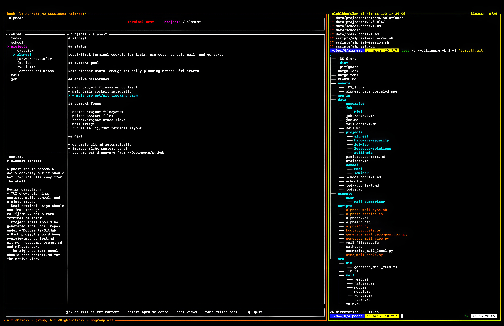

# alpnest

Alpnest is an open-source, local-first, highly customizable terminal nest.

It is designed as a multi-view, multi-layered terminal cockpit for personal planning, project context, mail signals, calendar surfaces, and future local-first workflows. The default open-source version is intentionally generic: it does not ship with Alp-specific school courses, private projects, account names, local paths, or hardcoded personal data.

Built with Rust, Ratatui, local markdown stores, local-first mail tooling, and a terminal-first workflow.



## contents

- [what this is](#what-this-is)
- [current architecture](#current-architecture)
- [main explorer view](#main-explorer-view)
- [content model](#content-model)
- [default contents](#default-contents)
- [filesystem layout](#filesystem-layout)
- [configuration model](#configuration-model)
- [runtime and generated state](#runtime-and-generated-state)
- [mail pipeline](#mail-pipeline)
- [local customization](#local-customization)
- [running locally](#running-locally)
- [debugging the registry](#debugging-the-registry)
- [roadmap](#roadmap)
- [development status](#development-status)

## what this is

Alpnest sits before the work starts.

It is not meant to replace a shell, editor, calendar, mail client, project tracker, or agent runtime. Instead, it gives the terminal a structured nest where local context can be inspected before deciding what to do next.

Alpnest should help answer questions like:

- what needs attention now?
- which content surface am I currently working in?
- what context belongs to this project, task, mail view, or calendar view?
- which local files represent the current body and context?
- what should be handed to a local tool, LLM, script, or future workflow?

The design philosophy is simple:

- local-first before cloud-first
- readable files before hidden databases
- inspectable automation before opaque agents
- terminal-native interaction before heavy UI
- user customization outside the open-source defaults

## current architecture

Alpnest is now organized around a dynamic content architecture.

The important distinction is:

```text
app view != content
```

An app view is a real UI surface or interaction mode. The currently implemented view is the main explorer. Future app views include adding/editing content, building panels, cooking sections, configuring mail accounts, and rendering calendar-specific surfaces.

A content is a user-facing area of work or information. Contents are loaded dynamically from the filesystem.

Current Rust architecture:

```text
src/
  app.rs                 app state and selection model
  app_view.rs            app-level view state
  content/
    model.rs             Content, Panel, Section, ContentType
    registry.rs          filesystem-backed content registry
  ui/
    main_explorer.rs     main explorer snapshot/navigation adapter
  main.rs                Ratatui runtime and rendering
  mail/                  local mail feed/filter/render modules
```

The current runtime path is:

```text
data/contents
  -> ContentRegistry
  -> AppState
  -> MainExplorerSnapshot
  -> Ratatui main explorer
```

## main explorer view

The main explorer is the first implemented app view.

It has four visible regions:

```text
header
left top:    content / panel / section tree
left bottom: context area
right:       selected body area
footer:      controls and keybindings
```

The navigation hierarchy is:

```text
content
  panel
    section
```

Examples:

```text
Today

Mail
  Overview
    Overview

Calendar
  Daily
    Daily
  Weekly
    Weekly
```

The main explorer is not the whole application. It is one app view. Placeholder app views already exist for future workflows:

- add content
- edit content
- build panel
- cook section
- configure mail
- calendar

## content model

Alpnest uses three content layers.

### content

A content is a top-level surface. Examples are `today`, `mail`, `calendar`, `school`, `job`, or `projects`.

A content has:

- id
- title
- content type
- root path
- optional body path
- optional context path
- zero or more panels
- order
- hidden flag

### panel

A panel belongs to a content.

A panel has:

- id
- title
- path
- optional `.prompt.md`
- zero or more sections
- order
- hidden flag

Panel-local prompts are intentionally scoped. A `.prompt.md` file belongs only to that panel and must not affect other panels, contents, or global behavior.

### section

A section belongs to a panel.

A section has:

- id
- title
- body markdown path
- optional context markdown path
- order
- hidden flag

The default section pairing is:

```text
overview.md
overview.context.md

notes.md
notes.context.md
```

Dotfiles, `.cfg` files, and `.prompt.md` files are hidden from normal navigation.

## default contents

The open-source default version currently ships only generic default contents:

```text
data/contents/
  00-today/
  10-mail/
  20-calendar/
```

These are intentionally not Alp-specific.

### today

`today` is a minimal content.

```text
data/contents/00-today/
  .today.cfg
  overview.md
  context.md
```

A minimal content has no panels and no sections. It only has its own body and context.

### mail

`mail` is a special default content.

```text
data/contents/10-mail/
  .mail.cfg
  overview.md
  mail-notes.md
```

Mail has no panel-local `.prompt.md`. Mail account panels are expected to be configured or discovered locally. Raw secrets must not be stored in `.mail.cfg`.

The existing local mail pipeline is preserved, but the main explorer now treats mail as a content surface rather than a hardcoded top-level panel.

### calendar

`calendar` is a planned special default content.

```text
data/contents/20-calendar/
  .calendar.cfg
  overview.md
  daily.md
  daily.context.md
  weekly.md
  weekly.context.md
```

The current calendar files are placeholders. A later calendar view may render an actual calendar surface instead of ordinary markdown.

## filesystem layout

Current repository layout:

```text
data/
  contents/
    00-today/
    10-mail/
    20-calendar/
  generated/
  store/
    generated/
      state/

examples/
  alp-local-contents/
    school/
    projects/
    job/
    legacy/root notes
```

The `examples/alp-local-contents/` directory exists as an example of user-local customization. It is not part of the default open-source Alpnest runtime model.

The old hardcoded data model has been removed from the default path:

- old root `data/*.md` content files are no longer the canonical model
- old `data/panels/` experiment has been removed
- Alp-specific school/job/project data has been moved out of core defaults
- visible `prompt.md` files have been renamed to hidden `.prompt.md`

## configuration model

Each content may have a hidden `.cfg` manifest:

```text
.today.cfg
.mail.cfg
.calendar.cfg
.<content>.cfg
```

These files are versioned typed manifests. They describe user intent and behavior configuration.

They may contain:

- schema version
- id
- title
- content type
- hidden flag
- ordering
- UI defaults
- deadline settings
- panel settings
- section settings
- watcher/probe definitions
- mail/project/calendar-specific settings

They must not contain:

- passwords
- raw tokens
- generated mail summaries
- git dirty state
- CI result state
- runtime probe results

Runtime results belong under generated state paths, not inside `.cfg` files.

The current Rust parser is intentionally minimal. Full typed manifest parsing is planned.

## runtime and generated state

Alpnest separates configuration, source content, and runtime state.

Repository defaults live under:

```text
data/contents/
```

Generated or runtime state should live under paths such as:

```text
data/generated/
data/store/generated/state/
~/.local/share/alpnest/
```

The important rule:

```text
.cfg defines what to check.
runtime state stores what happened.
```

For example, a future project content may define git status watchers in its manifest, but the latest dirty/clean result should be stored in generated state, not in the manifest.

## mail pipeline

The mail pipeline remains local and file-backed.

Current direction:

```text
Apple Mail
  -> scripts/sync_mail_apple.py
  -> local store
  -> scripts/summarize_mail_local.py
  -> src/mail/* Rust feed builder and renderer
  -> generated markdown views
  -> alpnest TUI
```

Apple Mail is currently the preferred local source of truth for mailbox access. The project is not moving toward Gmail API, Microsoft Graph, or OAuth HTTP sync as the default direction.

The mail system includes:

- deterministic filtering
- local event stream storage
- local body storage
- optional local Qwen/Ollama summarization
- account-aware rendering
- attention-aware placement: overview, account-only, or hidden

Mail sync is intentionally separate from the content registry. The main explorer should be able to represent mail as a content surface without redesigning the mail backend.

## local customization

The default repository should stay generic.

User-specific contents such as school, job, and personal projects should live in user-local content roots, not in the open-source defaults.

The current example local content tree is:

```text
examples/alp-local-contents/
  school/
  projects/
  job/
```

A future registry patch should support explicit local content roots such as:

```text
ALPNEST_CONTENT_HOME
~/.config/alpnest/contents
~/.local/share/alpnest/contents
```

That will allow a local instance to load personal contents without reintroducing them into the repository defaults.

## running locally

Install the binary:

```sh
cargo install --path . --force
```

Run the TUI:

```sh
alpnest
```

Run without session integration if using a raw terminal workflow:

```sh
ALPNEST_NO_SESSION=1 alpnest
```

Run checks:

```sh
cargo fmt --check
cargo check
cargo test
```

Run the registry inspection tool:

```sh
cargo run --bin inspect_content_registry
```

Expected default output:

```text
contents: 3
- Today [Minimal] panels=0 body=Some("data/contents/00-today/overview.md")
- Mail [Mail] panels=1 body=Some("data/contents/10-mail/overview.md")
  - Overview sections=1 synthetic=true
    - Overview -> data/contents/10-mail/overview.md
- Calendar [Calendar] panels=2 body=Some("data/contents/20-calendar/overview.md")
  - Daily sections=1 synthetic=true
    - Daily -> data/contents/20-calendar/daily.md
  - Weekly sections=1 synthetic=true
    - Weekly -> data/contents/20-calendar/weekly.md
```

Generate the mail feed manually:

```sh
cargo run --bin generate_mail_feed
```

Run the mail sync wrapper manually:

```sh
scripts/alpnest-mail-sync.sh
```

## debugging the registry

Use:

```sh
cargo run --bin inspect_content_registry
```

This prints the discovered content tree without opening the TUI. It is useful for checking whether the registry sees the expected contents, panels, synthetic panels, and sections.

A healthy default registry currently discovers:

```text
Today
Mail
Calendar
```

If only those three appear, the open-source default is clean and no Alp-specific local data has leaked into the core runtime.

## roadmap

Near-term:

- rewrite README and docs around the dynamic architecture
- add user-local content root discovery
- replace the manifest stub with typed manifest parsing
- add scroll support for body and context panes
- polish footer and keybinding display
- add generated-state lookup for mail content
- make calendar rendering more than placeholder markdown
- add add/edit content view
- add build/reshape panel view
- add cook section workflow

Later:

- project git/build/dev watchers
- GitHub Actions or CI probes
- deadline propagation and effective deadline display
- audit-friendly deadline extension entries
- local task promotion from mail/calendar/project context
- controlled handoff packets for LLM-assisted planning
- editable notes and prompt flows through the terminal editor
- optional Zellij/tmux workspace integration

## development status

The dynamic architecture branch currently validates with:

```sh
cargo fmt --check
cargo check
cargo test
cargo run --bin inspect_content_registry
```

The current test suite includes the existing mail feed/filter/render tests. The migration intentionally does not redesign `src/mail/*`.

Alpnest is still early. The useful part is not that it is complete. The useful part is that the architecture is now explicit enough to evolve without hardcoding one person's life into the default application.
