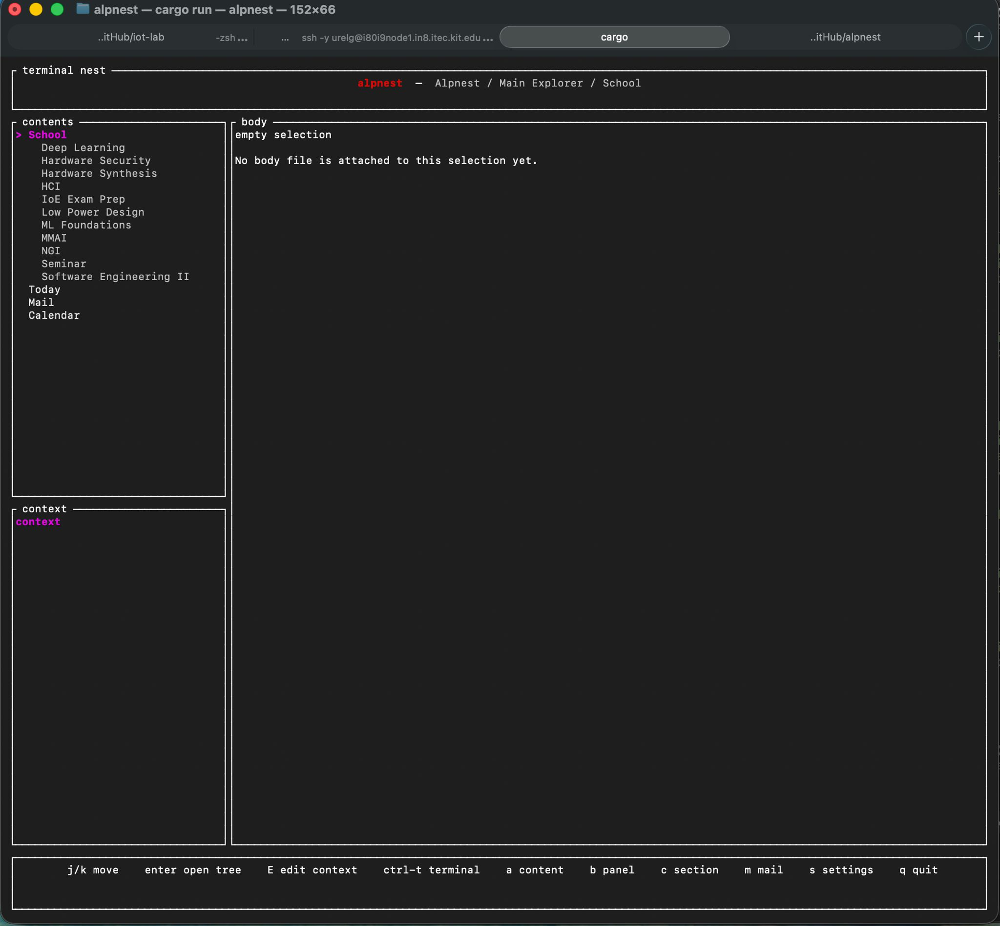
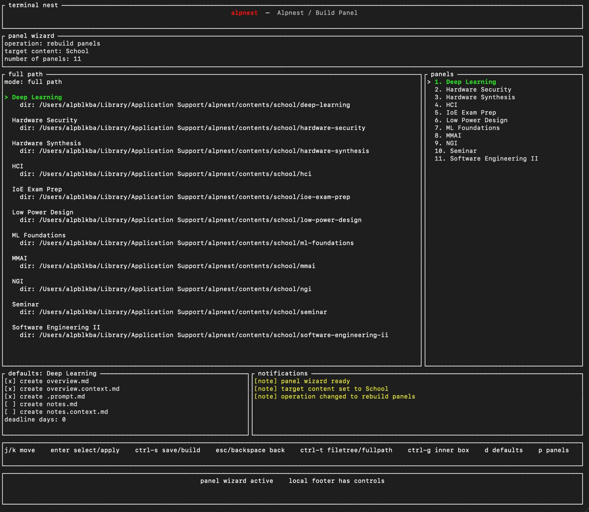

# alpnest

Alpnest is a local-first terminal cockpit for organizing working context across projects, courses, mail, calendar surfaces, notes, and shell workflows.

It is built around a filesystem-backed content model and a Ratatui interface. The goal is to keep the user's operational context close to the terminal: inspect the current work surface, navigate related panels and sections, open markdown context, run a shell in the right pane, and build new working structures without leaving the TUI.



## Table of contents

- [Overview](#overview)
- [Status](#status)
- [Core concepts](#core-concepts)
  - [Views](#views)
  - [Contents](#contents)
  - [Panels](#panels)
  - [Sections](#sections)
- [Application views](#application-views)
  - [Main explorer](#main-explorer)
  - [Content editor](#content-editor)
  - [Panel wizard](#panel-wizard)
  - [Cook section](#cook-section)
  - [Configure mail](#configure-mail)
  - [Section workbench](#section-workbench)
  - [Settings](#settings)
  - [Reserved views](#reserved-views)
- [Keybindings](#keybindings)
- [Themes](#themes)
- [Filesystem model](#filesystem-model)
- [Runtime paths](#runtime-paths)
- [Configuration](#configuration)
- [Embedded terminal](#embedded-terminal)
- [Local LLM](#local-llm)
- [Mail pipeline](#mail-pipeline)
- [Build and run](#build-and-run)
- [Development commands](#development-commands)
- [Registry debugging](#registry-debugging)
- [Implementation trace](#implementation-trace)
- [Roadmap](#roadmap)

## Overview

Alpnest is not a general-purpose IDE and it is not a replacement for a shell, editor, mail client, or calendar. It is a terminal-native context layer that sits above those tools.

The application is designed for workflows where the user repeatedly needs to answer:

- what work surface am I in?
- which projects, courses, or operational panels belong to it?
- where are the body and context files for the current selection?
- what should be opened in the right-pane terminal?
- which mail or calendar signals need attention?
- what structure should be created before work begins?

The main design principles are:

- local files before hidden application state
- readable markdown before opaque storage
- explicit context before automation
- terminal-native navigation before browser-heavy UI
- user runtime data outside the source tree
- deterministic scaffolding for contents, panels, and sections

## Status

Implemented:

- Ratatui main explorer
- automatic first-run content and runtime initialization
- `alpnest doctor` checks Python, Ollama, and the configured local model
- dynamic content registry backed by the filesystem
- content types that gate behavior, not just describe it
- content/panel/section navigation
- content editor with add/remove modes; body and context editing stays in Markdown
- panel wizard for batch panel creation
- panel display titles loaded from `.panel.cfg`
- per-panel defaults for generated files
- embedded right-pane PTY terminal
- Vim/editor workflow inside the TUI
- right-pane shell toggle in main workflows
- settings file under the runtime configuration directory
- local-first mail pipeline modules and generated mail surfaces
- cook section view: cook, rename and remove `<section>.md` / `<section>.context.md` pairs
- configure mail view: multi-account IMAP setup with Keychain-backed credentials
- multi-account IMAP sync projecting one mail panel per connected account
- incremental fetch tracking UIDVALIDITY and per-mailbox UID watermarks
- mail drill-down: each message is a section holding the full original
- MIME body parsing, taking text/plain with an HTML fallback
- summarization wired into the sync, waking and unloading the model per batch
- selectable summarizer backend (ollama, Anthropic, OpenAI) with behavior
  pinned across models
- classified IMAP failures with per-provider remedies and auth backoff
- background sync at launch plus a LaunchAgent timer
- section workbench: a standalone working surface per section
- reviewable local-model drafts from the section workbench
- swappable themes (`nest`, `euporie`, `btop`, `mono`) applied across every view

Partially implemented or reserved:

- panel rebuild workflow
- panel rename/move workflow
- destroy confirmation polish
- calendar-specific rendering
- project content git discovery
- deadline read-back (deadlines are written to manifests but not yet enforced)
- complete terminal-emulator behavior for the embedded terminal
- typed manifest parsing beyond the current minimal parser

## Core concepts

Alpnest separates UI state from content state.

```text
app view != content
```

An app view is an interaction surface: main explorer, content editor, panel wizard, cook section, configure mail, section workbench, and settings.

A content is a filesystem-backed work surface: for example school, projects, mail, calendar, job, today, or any other configured top-level area.

The content tree has three layers:

```text
content
  panel
    section
```

### Views

Views are application modes. They define how input is handled and how the terminal is laid out.

Current views:

- main explorer
- content editor
- panel wizard
- cook section
- configure mail
- section workbench
- settings

Reserved views:

- calendar-specific surfaces
- project git surfaces
- future agentic development surfaces

### Contents

A content is a top-level work surface.

Examples:

- `Today`
- `School`
- `Projects`
- `Mail`
- `Calendar`
- `Job`

A content may be minimal, with only an overview/context pair, or it may contain many panels.

Content metadata may be described by a hidden manifest such as:

```text
.today.cfg
.mail.cfg
.calendar.cfg
.school.cfg
.projects.cfg
```

A content has:

- id
- display title
- content type
- root path
- optional body path
- optional context path
- panels
- order
- hidden flag

#### Content types drive behavior

The declared `content_type` is not decoration. It decides which operations a
content admits:

| type | panels are | sections | cook section | build panel | workbench |
|---|---|---|---|---|---|
| `minimal` | none | none | — | — | — |
| `task` | authored units of work | yes | yes | yes | yes |
| `project` | git repositories | yes | yes | yes | yes |
| `mail` | connected accounts | messages | no | no | no |
| `calendar` | daily / weekly | dates | no | no | no |

`mail` and `calendar` are **special contents**. They render their own domain
surface and are generated from messages and dates rather than authored, so the
section grammar does not apply to them. Pressing `c` or `b` inside one explains
why instead of opening a wizard, and opening one of their leaves shows the
message or the date rather than a task workbench.

Everything else follows the ordinary content → panel → section grammar.

### Panels

A panel belongs to exactly one content. It represents a major unit of work inside that content.

Examples under a school content:

- Deep Learning
- Hardware Security
- Low Power Design
- Software Engineering II

Examples under a projects content:

- alpnest
- iot-lab
- rv32i-mla
- hardware-security

Panel display titles and filesystem slugs are intentionally separate.

```text
title: Software Engineering II
slug:  software-engineering-ii
path:  contents/school/software-engineering-ii/
```

A panel may contain:

```text
.panel.cfg
.prompt.md
overview.md
overview.context.md
notes.md
notes.context.md
additional section files
```

The `.panel.cfg` file stores panel metadata. The `.prompt.md` file is panel-local and should be interpreted as scoped context for that panel, not as global application behavior.

### Sections

A section belongs to a panel. It is usually represented by a markdown body file and an optional context file.

Typical section pairs:

```text
overview.md
overview.context.md

notes.md
notes.context.md
```

Dotfiles and config files are hidden from normal explorer navigation. User-facing section files remain visible.

## Application views

### Main explorer

The main explorer is the default view. It shows the content tree, current context, current body, and optionally the embedded terminal.

Layout:

```text
header
left top:     content / panel / section tree
left bottom:  context pane
right:        body pane or embedded terminal
footer:       controls
```

Typical controls:

```text
j/k            move, wrapping at both ends
enter          descend, or open a section's workbench
E              edit selected context markdown
Ctrl-T         toggle right-pane shell
a              content editor
b              panel wizard
c              cook section
m              configure mail
s              settings
q              quit
```

When the embedded terminal is inactive, the right pane shows markdown content for the selected item. When the embedded terminal is active, the same pane becomes a live PTY-backed shell or editor surface.

### Content editor

The content editor manages top-level content surfaces.

Modes:

```text
add new content
remove existing content
```

Content creation is intentionally less complex than panel creation. A content is a broad category. Most repeated structure work is expected to happen through panels and sections.
Existing body and context files are edited directly with `e` / `E`; metadata
editing is not exposed until it can be implemented without unsafe path moves.

### Panel wizard

The panel wizard is a dedicated view for creating and inspecting panels under a selected content.

Panel creation is common enough that it needs a structured workflow instead of ad-hoc shell commands or manual directory creation. The wizard supports batch creation, panel-local defaults, full-path previews, and filetree previews.



Panel wizard layout:

```text
header:        operation, target content, panel count
middle left:   full-path preview or filetree preview
middle right:  panel list
bottom left:   defaults for the selected panel
bottom right:  notifications
footer:        panel-wizard controls
```

Operations:

```text
build panels
rebuild panels
destroy panels
```

The build workflow supports:

- editing the number of panels explicitly
- editing panel titles with spaces
- slugifying panel paths
- preserving display titles in `.panel.cfg`
- per-panel file defaults
- full-path preview before writing
- filetree preview before writing
- explicit save/build through `Ctrl-S`

Panel wizard controls:

```text
j/k or arrows       move
enter               select/apply current field
Ctrl-S              save/build current operation
esc/backspace       local back or exit
Ctrl-T              toggle full-path/filetree preview
Ctrl-G              focus inner preview
p                   focus panel list
d                   focus defaults for selected panel
r                   rename/move placeholder
f                   focus top fields
```

Inside the panel wizard, `Ctrl-T` does not open the embedded shell. It toggles the inner preview mode. The shell toggle remains a main-explorer workflow.

Example panel manifest generated by the wizard:

```toml
schema_version = 1
id = "deep-learning"
title = "Deep Learning"
kind = "panel"
hidden = false
order = 0
prompting_enabled = true
deadline_enabled = false
deadline_days = 0
```

### Cook section

Opened with `c` from the main explorer, against the currently selected panel.
Sections are the leaf of the grammar, so this is the view that stops the leaf
layer from needing hand-edited files.

Three operations:

- **cook** — create `N` sections, each a `<slug>.md` / `<slug>.context.md` pair
- **edit** — rename a section, moving both files together
- **remove** — delete the pair, behind a second-`enter` confirmation

Per-section defaults choose whether to write the body, the context, a starter
template (`blank`, `notes`, `milestones`, `exercise`, `reference`) and a
deadline. The layout mirrors the panel wizard so the muscle memory carries
over, and `ctrl-t` flips the preview between full paths and a filetree.

Because this writes into a live panel, the writer refuses slugs that collide
with the panel's own reserved files (`context`, `prompt`, `panel`), refuses
names starting with a dot or ending in `.context`, refuses to overwrite on
rename, and scopes removal to direct children of the panel directory.

### Configure mail

Opened with `m`, or from the settings view. It runs its own palette on purpose:
configuring an account is a higher-stakes surface than browsing markdown and
should not look like it.

```text
accounts list  |  connection form
provider notes |  mail log
footer
```

The form covers display name, provider, email, login name, IMAP host, port,
security, mailboxes, first-sync and per-sync limits, enabled state, the
credential row, and the summarizer backend. Actions test the connection, sync
one account, save, and remove.

Supported providers: GMAIL, MICROSOFT 365 / Exchange Online, ICLOUD, YAHOO,
generic IMAP, and local Apple Mail. Mail panels are created here and only here
— you cannot build a panel or cook a section inside mail.

### Settings

The settings view edits runtime behavior.

Current settings include:

- text editor command
- terminal layout
- reload after external edit
- theme, cycling through the four shipped palettes and applying immediately
- open mail account configuration
- keymap placeholder
- agentic development placeholder

Example config:

```toml
text_editor = "vim"
terminal_layout = "built_in_right_pane"
reload_after_external_edit = true
theme = "nest"
keymap = "default"
agentic_development = false
```

### Section workbench

Opening a section with `enter` leaves the three-pane explorer and gives that
section the whole screen.

The workbench deliberately avoids the board-and-cards model. A Trello-style
board makes you maintain containers, and the real state ends up in a database
reachable only through the UI. Here the **document is the state**: steps are
the `- [ ]` / `- [x]` checkboxes already inside the section's markdown, and
toggling one rewrites that exact line in the file. Editing in vim and toggling
in the TUI are the same operation on the same bytes, so there is nothing to
sync and the file stays readable without Alpnest.

On top of that the view answers the question a board never does — *what do I do
next?* The first unfinished step is pinned and highlighted.

```text
breadcrumb + completion meter
steps rail  |  body or editor  |  brief + signals
footer
```

- `j` / `k` move, `space` toggles the selected step
- `n` jumps to the next action
- `tab` switches between the steps rail and the body
- `e` edits the body, `c` edits the context, `ctrl-t` opens a terminal
- `a` asks the local Ollama model for a separate draft
- `v` switches the right column between section context and the local draft
- `r` reloads from disk after an external edit

The model never rewrites the section. It writes a hidden
`.<section>.llm-draft.md` beside it, so the user reviews and applies any useful
parts. Sections with no checkboxes show how to add them rather than an empty
pane.

### Reserved views

Reserved views exist so the UI model can grow without treating every workflow as a content item.

Current reserved directions:

- calendar-specific rendering
- project git tracking surfaces
- local agent handoff and workflow surfaces

## Keybindings

Main explorer:

| key | action |
|---|---|
| `j` / `k` | move, wrapping at both ends |
| `enter` | descend, or open a section's workbench |
| `E` | edit the context file |
| `ctrl-t` | toggle the right-pane terminal |
| `a` | add / remove content |
| `b` | build panels |
| `c` | cook sections |
| `m` | configure mail |
| `s` | settings |
| `q`, `ctrl-q`, `ctrl-c` | quit |

`ctrl-q` and `ctrl-c` quit from anywhere, including inside a wizard, so there
is always one way out that does not depend on which view has focus.

Every other binding is an unmodified key. Keys carrying `ctrl` or `alt` that a
handler does not claim are dropped rather than falling through to the bare
letter arm — without that guard, `ctrl-a` opened the content editor and
`ctrl-x` typed an `x` into a text field.

Each wizard renders its own footer with its local controls.

## Themes

Four themes ship, cycled from the settings view and applied on the next frame:

| name | character |
|---|---|
| `nest` | default; saturated accents on a deep neutral base |
| `euporie` | soft, low-chroma, generous dim text |
| `btop` | high contrast, for bright terminals and screenshots |
| `mono` | no colour, for plain terminals |

Configure Mail additionally runs a separate amber palette that is not in the
user cycle, because account configuration should not look like note browsing.

Views never hardcode a colour; they ask the theme. That is what makes the
palette swappable and lets mail run its own. The shared helpers cover bordered
blocks that brighten on focus, filled selection rows, checkboxes, field rows,
status badges, and footer key chips.

## Filesystem model

The source repository may contain generic defaults, but user runtime data is resolved separately.

A typical runtime tree looks like:

```text
ALPNEST_HOME/
  config/
    alpnest.toml
    mail/
      accounts.cfg          connection metadata + summarizer choice, no secrets
  runtime/                  product-owned helpers extracted from the binary
    scripts/
    prompts/
  contents/
    school/
      deep-learning/
        .panel.cfg
        .prompt.md
        overview.md
        overview.context.md
      hardware-security/
        .panel.cfg
        overview.md
        overview.context.md
    projects/
      alpnest/
      iot-lab/
      inbox/
        first-steps.md
        .first-steps.llm-draft.md  generated, review-only local-model output
    mail/
      .mail.cfg
      overview.md           combined digest, the content's own body
      kit/                  one directory per connected account
        000-overview.md     summarized message list
        001-<date>-<subject>-<hash>.md          full original message
        001-<date>-<subject>-<hash>.context.md  its summary and triage
      gmail/
    20-calendar/
  drafts/
  raw/mail/messages/        fetched bodies, keyed by message id
  store/
    messages.json           every message ever fetched
    eventstreams.json       grouped streams the summarizer reads
    mail_sync_state.json    per-mailbox UID watermark and auth backoff
  generated/
  logs/
```

Mail panels are exactly the account directories. Loose markdown at the mail
root is deliberately not promoted to a panel, so the combined digest in
`overview.md` shows when `Mail` itself is selected without appearing as a
fake account beside the real ones.

A leading `NN-` on a section file sets its sort order and is stripped from the
display title; top-level contents support the same convention. Generated mail sections use it to keep the summary list pinned
first and messages newest-first. A section also takes its display title from
its own `# heading` when it has one, which is what makes a generated message
read as its subject rather than as its filename.

The registry loads visible content from the configured content root. Dotfiles and manifests are used for metadata but are not shown as normal sections.

Panel names are slugified for paths:

```text
Deep Learning           -> deep-learning
Software Engineering II -> software-engineering-ii
Low Power Design        -> low-power-design
```

The display title is preserved separately in the manifest.

## Runtime paths

Runtime path resolution is handled by `AlpnestPaths`.

Priority:

```text
ALPNEST_HOME
platform default
```

On macOS, the default runtime location is:

```text
~/Library/Application Support/alpnest
```

This allows development runs to use:

```sh
cargo run
```

without exporting `ALPNEST_HOME` every time.

On the first launch, an empty home receives small `Today`, `Projects`, and
`Mail` starter surfaces. Initialization never adds defaults to a non-empty
content directory and never overwrites user-authored content. Product-owned
Python helpers and prompts are embedded in the binary and refreshed under
`runtime/`, so an installed binary does not depend on a source checkout.

Note that `~/Library` is hidden in Finder and macOS shows localized folder
names, so the directory can look absent even though it exists. To inspect it:

```sh
open ~/Library/Application\ Support/alpnest
```

The Python helpers resolve the same root through `scripts/paths.py`. They
previously hardcoded `~/.local/share/alpnest` while the app read
`~/Library/Application Support/alpnest`, which meant the sync wrote output the
TUI never read. Both sides now agree; `ALPNEST_DATA_HOME` still overrides the
store location if you need them apart.

## Configuration

Alpnest uses small manifest files for content and panel metadata.

Content manifests:

```text
.<content>.cfg
.today.cfg
.mail.cfg
.calendar.cfg
```

Panel manifests:

```text
.panel.cfg
```

These manifests are intended for stable configuration such as:

- schema version
- id
- title
- type/kind
- hidden flag
- order
- prompting settings
- deadline settings
- future watcher definitions

They should not store volatile runtime state such as:

- generated mail summaries
- latest git status
- probe results
- CI state
- temporary agent output
- secrets or tokens

Volatile state belongs under generated runtime directories.

### Mail configuration

`$ALPNEST_HOME/config/mail/accounts.cfg` is written by the Configure Mail view:

```text
[summarizer]
provider = "ollama"          # ollama | anthropic | openai
model = "qwen3:8b"

[account.kit]
display_name = "KIT"
provider = "imap"
email = "someone@student.kit.edu"
username = "someone"         # login name when it differs from the address
imap_host = "imap.kit.edu"
imap_port = 993
security = "ssl"             # ssl | starttls
mailboxes = "INBOX"
initial_limit = 20           # messages pulled on the first sync
batch_limit = 10             # ceiling per later pass
enabled = true
```

This file holds connection metadata only. There is a test asserting that a
serialized account block contains no `password`, `token` or `secret` key.

### Secrets

Alpnest never accepts, holds, or stores a password. It asks the macOS Keychain
two things: whether a secret exists for an account id, and to prompt the user
to set one. Selecting the credential row spawns

```sh
security add-generic-password -U -a <account> -s alpnest-mail -l "…" -w
```

in the right pane, so macOS does the prompting. `-w` carries no value, which is
what makes it interactive rather than passing a secret on the command line. The
sync helper reads the value from the Keychain at fetch time and never writes it
anywhere.

| purpose | Keychain service | account |
|---|---|---|
| mail password | `alpnest-mail` | `<account id>` |
| summarizer API key | `alpnest-mail` | `summarizer:<provider>` |

## Embedded terminal

Alpnest includes a PTY-backed right-pane terminal.

Current stack:

```text
portable-pty  -> process and PTY
vt100         -> terminal screen parser
ansi-to-tui   -> ANSI text conversion
Ratatui       -> rendering
```

Implemented behavior:

- `Ctrl-T` opens/closes a right-pane shell from main workflows
- selected markdown context can be opened in the embedded editor
- Vim can run inside the right pane
- user Vim configuration can load
- shell commands can be run without leaving the TUI
- closing the embedded editor reloads the registry when configured

Known limitations:

- rendering is usable but not a complete terminal emulator
- mouse forwarding is not complete
- Vim split handling is functional but not as smooth as a native terminal
- a future renderer should move closer to cell-grid terminal rendering

## Local LLM

The first active local-model workflow lives in the section workbench. Press
`a` to send the current section body, its context, and the panel's `.prompt.md`
to Ollama on `127.0.0.1`. The default model is `qwen3:8b`; override it without
changing files:

```sh
ALPNEST_OLLAMA_MODEL="qwen3:4b" alpnest
```

The response is written beside the source as
`.<section>.llm-draft.md`. That file is hidden from normal section navigation,
shown with `v`, and safe to regenerate. Alpnest never applies the response to
the source section automatically.

Before opening the TUI, verify the complete local path:

```sh
alpnest doctor
```

The doctor initializes an empty runtime and checks the bundled helper, Python,
the Ollama service, and the selected model. It exits non-zero when local draft
generation is not ready and prints the concrete next command where possible.

## Mail pipeline

Mail is fetched over IMAP, stored locally, summarized by a model, and projected
as markdown that the ordinary content registry reads. Every stage is separate so
failures stay debuggable and any stage can be replaced independently.

```text
IMAP accounts (GMAIL, MICROSOFT, ICLOUD, YAHOO, generic)
  -> scripts/sync_mail_imap.py        incremental, read-only fetch
  -> store/messages.json              full history
  -> store/eventstreams.json          grouped streams
  -> scripts/summarize_mail_local.py  prompt pack + selectable backend
  -> contents/<mail>/<account>/       one section per message
  -> Alpnest main explorer
```

### Read-only by construction

Syncing can never mutate the server or your mail state:

- mailboxes are selected with `readonly=True`
- every fetch uses `BODY.PEEK`, so messages are not marked as read
- nothing is ever deleted, moved, or flagged

### Incremental fetch

IMAP UIDs are monotonic within a mailbox while `UIDVALIDITY` is stable, so the
sync records the highest UID it has seen per mailbox in
`store/mail_sync_state.json` and asks the server for `UID last+1:*` on every
later pass. Consequences:

- already-fetched mail is never downloaded twice
- the store is the history; new mail merges in and nothing is dropped
- a `UIDVALIDITY` change is detected and triggers a clean resync
- `--reset` forgets the watermark when you want a deliberate refetch

Per-account volume is bounded by two numbers, both editable in the Configure
Mail view: `initial_limit` (default 20) for the first sync of a mailbox, and
`batch_limit` (default 10) as the ceiling for each later pass. The second one
matters because the sync runs on a one-minute timer; it stops a single tick
from handing the summarizer an unbounded pile of work.

### Message bodies

With `--bodies` the sync pulls the whole message and walks the parsed MIME tree,
taking `text/plain` and falling back to stripped HTML, skipping attachments.
Fetching `BODY.PEEK[TEXT]` instead returns the raw multipart envelope —
boundaries, per-part headers, base64 — which is unreadable and useless as
summary input.

Cached bodies are always rewritten rather than skipped when present, so an
improved parser can correct a body captured by an earlier one.

### Error handling

IMAP servers report auth problems as opaque blobs like
`b'[ALERT] Application-specific password required: https://...'`.
`scripts/mail_errors.py` classifies the common cases and prints a remedy:

| code | cause |
|---|---|
| `app_password_required` | GMAIL needs an App Password, never the account password |
| `invalid_credentials` | the stored secret is wrong |
| `microsoft_basic_auth` | tenant may require OAuth2 |
| `auth_failed` | IMAP disabled, or wrong address |
| `tls_failure` | wrong security mode, or a proxy breaking validation |
| `dns_failure` | host misspelled, or a VPN is required |
| `unreachable` | network, port, or firewall |
| `mailbox_missing` | mailbox name does not exist on this server |

Auth failures are not transient: a wrong app password fails identically every
time. On a per-minute timer that would be roughly 1,400 rejected logins a day,
which providers treat as an attack. A rejected credential therefore backs off
for 30 minutes, cleared automatically by a successful `--test`.

### Automation

`scripts/alpnest-mail-agent.sh` installs a LaunchAgent that syncs on a timer:

```sh
./scripts/alpnest-mail-agent.sh install 60
launchctl bootstrap gui/$(id -u) ~/Library/LaunchAgents/com.alpblkba.alpnest.mail.plist
```

`install` writes the plist and prints the load command rather than loading it
for you. `status` and `uninstall` do what they say.

Alpnest also starts one sync when it launches, detached, so opening the app
shows current mail without blocking the TUI on the network. The registry
reloads when the child exits.

A lock in `store/sync.lock` prevents overlapping passes, since the agent can
fire while a manual run or a slow summarization is still going.

### Summarization

The summarizer is a **prompt contract, not a fine-tune**. Seven files under
`prompts/qwen/mail_summarizer/` are concatenated into every request:

```text
system.md  context.md  task.md  output_schema.md
rubric.md  examples.md  failure_modes.md
```

The model's role is deliberately narrow. It is not a planner, scheduler, or
assistant. It converts one email into a compact JSON digest while preserving
visible facts: it cleans sender and subject for display, summarizes in one or
two sentences, preserves explicit actions and deadlines, classifies into one
allowed category, chooses an attention target and importance, and marks
`needs_human_review` rather than guessing.

### Selectable backend, fixed behavior

The model is selectable from the Configure Mail view; the behavior is not.

| provider | default model | credential |
|---|---|---|
| `ollama` | `qwen3:8b` | none, local |
| `anthropic` | `claude-sonnet-5` | Keychain `summarizer:anthropic` |
| `openai` | `gpt-4o-mini` | Keychain `summarizer:openai` |

Determinism across backends is enforced structurally rather than by convention.
Every provider receives the same prompt pack, is pinned to **temperature 0**,
and must return an object matching the same JSON schema. The result then runs
through identical category, attention, importance and retention normalisation,
plus the same deterministic fallbacks.

Swapping models can change how well a summary reads. It cannot change the data
shape, the allowed vocabulary, or what Alpnest does with the result.

### Model wake and sleep

A local model must not idle resident between one-minute syncs:

1. before contacting anything, the summarizer counts how many streams actually
   need work; if none, it exits without a single HTTP call
2. if the backend is unreachable, it degrades to the deterministic fallback
3. after the batch it unloads with `keep_alive: 0`, inside a `finally` so a
   crash cannot leave several GB resident

Progress is checkpointed to `eventstreams.json` every five streams, so a long
backlog survives interruption.

### Deterministic filtering and fallback

Independently of any model, the summarizer applies sender/subject/body filters
from `scripts/mail_filters.cfg` and deterministic category, attention and
importance rules for common patterns — school, assignment, exam, lab, seminar,
meeting, GitHub, security, event, application, newsletter, promotion.

This is why `--no-ollama` still produces usable triage, and why the pipeline
keeps working when no model is available at all.

## Build and run

Install from the repository:

```sh
cargo install --locked --path . --force
```

Verify the first-run and local-model setup:

```sh
alpnest doctor
```

Run during development:

```sh
cargo run
```

Run the installed binary:

```sh
alpnest
```

Run with an explicit runtime home:

```sh
ALPNEST_HOME="$HOME/Library/Application Support/alpnest" cargo run
```

## Development commands

Format and check:

```sh
cargo fmt --check
cargo check
cargo test
```

Run the TUI:

```sh
cargo run
```

Inspect the content registry:

```sh
cargo run --bin inspect_content_registry
```

Generate the mail feed:

```sh
cargo run --bin generate_mail_feed
```

Run the mail sync wrapper:

```sh
scripts/alpnest-mail-sync.sh
```

### Mail commands

Verify credentials and mailbox access without fetching or writing:

```sh
python3 scripts/sync_mail_imap.py --all --test
```

Note this exits non-zero if *any* account fails, so do not chain it with `&&`
before a real sync.

Fetch and summarize:

```sh
python3 scripts/sync_mail_imap.py --all --bodies --summarize
```

| flag | effect |
|---|---|
| `--account <id>` / `--all` | scope |
| `--test` | connect only, no writes |
| `--bodies` | fetch message bodies, needed for full-detail sections |
| `--summarize` | run the summarizer afterwards |
| `--reset` | forget UID state and refetch from scratch |
| `--watch --interval N` | foreground loop instead of the LaunchAgent |

Summarize on its own, optionally overriding the configured backend:

```sh
python3 scripts/summarize_mail_local.py --limit 20 --unload
python3 scripts/summarize_mail_local.py --provider anthropic --limit 20
python3 scripts/summarize_mail_local.py --no-ollama
```

Manage the background timer:

```sh
scripts/alpnest-mail-agent.sh install 60
scripts/alpnest-mail-agent.sh status
scripts/alpnest-mail-agent.sh uninstall
```

### Test content

Seed three throwaway School panels with five sections each, ordered after the
real courses. Removal only deletes files carrying the generator's marker, so
anything hand-edited inside a seeded panel survives:

```sh
python3 scripts/seed_test_content.py --seed
python3 scripts/seed_test_content.py --remove
```

## Registry debugging

Inspect runtime content:

```sh
find "$HOME/Library/Application Support/alpnest/contents" -maxdepth 3 -print
```

Inspect panel manifests:

```sh
find "$HOME/Library/Application Support/alpnest/contents" -name ".panel.cfg" -print
```

Run the registry inspector:

```sh
cargo run --bin inspect_content_registry
```

The registry inspector is useful for validating:

- discovered contents
- panel ordering
- panel display titles
- synthetic panels
- section body/context pairing
- hidden manifest handling

## Implementation trace

This section records the current implementation direction and design decisions.

### Runtime data separation

The runtime content root was moved behind `AlpnestPaths`.

Important decisions:

- content loading uses a resolved runtime content directory
- config is stored under `ALPNEST_HOME/config/alpnest.toml`
- generated drafts and runtime files stay outside the source tree
- the app can run with `cargo run` using platform defaults

### Embedded terminal

The right pane can now host a live PTY-backed shell or editor.

Important decisions:

- use `portable-pty` for the process boundary
- parse terminal output through `vt100`
- render ANSI output into Ratatui
- support editor-first workflows without leaving the app
- keep `Ctrl-T` as a shell toggle outside the panel wizard

### Content editor

The content editor supports:

- add content
- remove existing content
- edit existing body/context Markdown from the explorer

Content creation is intended to be less frequent than panel creation.

### Panel wizard

The panel wizard was added to make panel creation reliable and repeatable.

Important decisions:

- panels are batch-created under a selected content
- panel titles may contain spaces
- paths are slugified
- display titles are stored in `.panel.cfg`
- defaults are per-panel
- preview state does not write files
- `Ctrl-S` is the explicit save/build action
- filetree preview should eventually show all real files in the panel, including sections

### Section workbench

Boards were rejected as the model. A Trello-style board makes you maintain
containers, and the real state ends up in a database reachable only through the
UI — the wrong shape for a markdown-backed terminal tool.

Important decisions:

- steps are the checkboxes already in the section's markdown; there is no
  second source of truth to keep in sync
- toggling rewrites exactly one line, preserving every other byte including a
  missing trailing newline
- the first unfinished step is pinned, so the view answers "what next" rather
  than showing a wall of containers
- a section with no checkboxes explains how to add them instead of rendering
  an empty pane

### Mail as a special content

Important decisions:

- `ContentType` gates behavior rather than being metadata; mail and calendar
  admit no sections, no built panels and no workbench
- mail panels are exactly the account directories, so loose markdown at the
  mail root is never promoted to a fake account
- each message is a section holding the unmodified original, with the model's
  digest in the paired context file
- summarization is a prompt contract, and determinism across backends is
  enforced by pinning temperature, schema and normalisation rather than by
  trusting the model

### Credential handling

Important decisions:

- Alpnest never accepts, holds, or stores a secret
- macOS does the prompting through an interactive `security` invocation
- config files carry connection metadata only, asserted by a test
- a rejected credential backs off rather than retrying every minute

## Roadmap

Near-term:

- finish rebuild mode in the panel wizard
- implement safe display-title rename
- design guarded path rename/move semantics
- improve destroy confirmation UX
- make filetree preview read the actual filesystem after creation
- add body/context scrolling
- improve embedded terminal rendering
- strengthen typed manifest parsing
- OAuth2 device flow for Microsoft tenants that block basic auth
- account-aware noise filters, so routine notifications skip the model
  entirely rather than costing a summarization each

Later:

- local git tracker for project content, then commit-map and graph rendering
- calendar rendering with macOS Calendar and Google Calendar integration
- a simple deadline mechanism that reads back what the wizards already write
- embedded music player opened by shortcut, plus tmux/zellij script updates
- mail attention scoring and richer summaries
- local task promotion from mail/calendar/project context
- local agent handoff packets
- cell-grid terminal renderer
